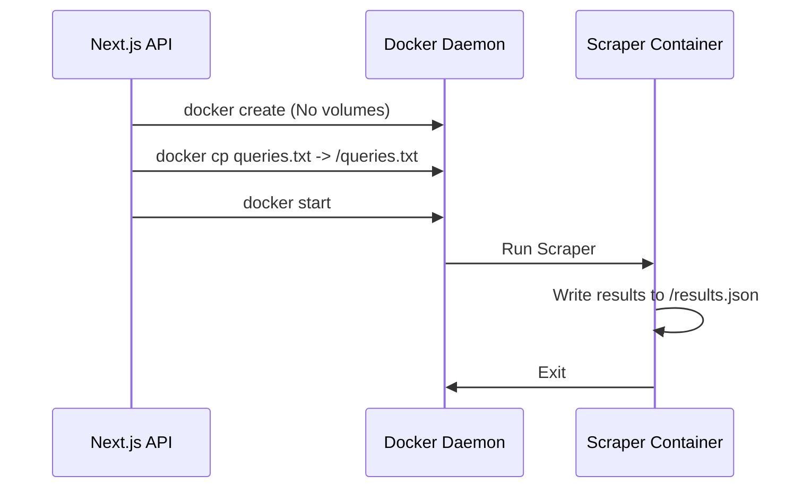

# System Architecture: Leads Command Center

This document outlines the core architectural decisions and workflows of the Leads Command Center application.

## High-Level Overview

The Leads Command Center is a Next.js 16.1 application that manages and monitors Google Maps scraping jobs. It uses Supabase for data storage, authentication, and RLS (Row Level Security).

## Core Workflows

### 1. Job Submission & Docker Integration
To resolve file permission and volume mount issues in WSL2/Docker Desktop for Windows, the application uses a **Create-Copy-Start** pattern instead of bind mounts.

### 2. JSON+Sync Architecture
Initially, the scraper was intended to write directly to Supabase. However, due to schema mismatches and the complexity of managing a job queue in the scraper's native format, we moved to a **JSON+Sync** model.

1. **Scrape**: The container writes leads to an internal NDJSON file (`/results.json`).
2. **Extract**: After exit, the app uses `docker cp` to extract `results.json` to the host's `.jobs/{jobId}/` directory.
3. **Parse & Sync**: The `/api/jobs/[id]/sync` endpoint parses the NDJSON and performs a bulk insert into Supabase's `results` table, injecting the correct `job_id` and `user_id`.

## Security Model

### Row Level Security (RLS)
Every table in Supabase (`jobs`, `results`, `job_presets`, etc.) has strict RLS enabled.
- **Ownership**: `auth.uid() = user_id`
- **Isolation**: Users can only see and manage their own jobs and leads.

### Server-Side Execution
Docker commands are executed using `child_process.spawn()` to prevent shell injection. Arguments are passed as an array to ensure proper sanitization.

## Network Architecture
The app connects to Supabase via **Supavisor (Session Mode)** on port 5432 to ensure IPv4 connectivity, bypassing IPv6 routing issues commonly found in Docker Desktop on Windows.

## Data Schema
- **Leads**: Stored in the `results` table.
- **JSONB**: The `data` column stores the full lead object from the scraper, while key fields (name, phone, website, rating, etc.) are extracted for efficient filtering.
- **Deduplication**: A unique index on `(user_id, cid)` prevents duplicate leads for the same user across different jobs.
